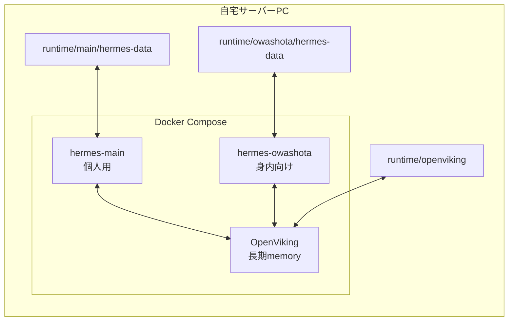
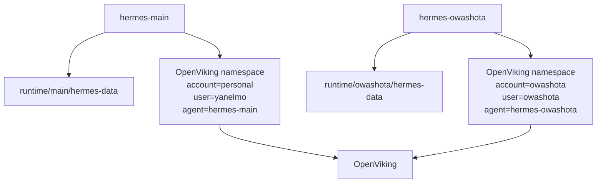
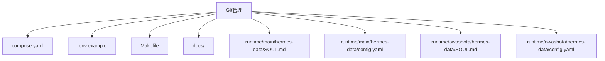
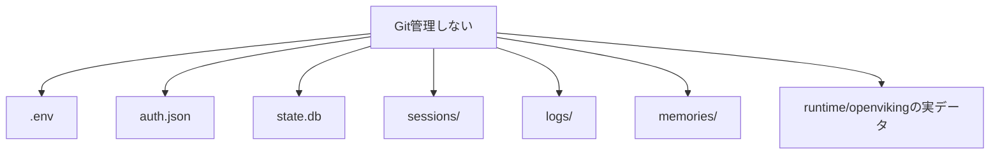

# 構成図

## 全体構成

```mermaid
flowchart LR
    subgraph SERVER[自宅サーバーPC]
        subgraph COMPOSE[Docker Compose]
            HM[hermes-main\n個人用]
            HO[hermes-owashota\n身内向け]
            OV[OpenViking\n長期memory]
        end

        MD[runtime/main/hermes-data]
        OD[runtime/owashota/hermes-data]
        OVD[runtime/openviking]
    end

    HM <--> OV
    HO <--> OV

    MD <--> HM
    OD <--> HO
    OVD <--> OV
```

## 分離方針

```mermaid
flowchart TD
    HM[hermes-main] --> MD[runtime/main/hermes-data]
    HO[hermes-owashota] --> OD[runtime/owashota/hermes-data]

    HM --> MNS[OpenViking namespace\naccount=personal\nuser=yanelmo\nagent=hermes-main]
    HO --> ONS[OpenViking namespace\naccount=owashota\nuser=owashota\nagent=hermes-owashota]

    MNS --> OV[OpenViking]
    ONS --> OV
```

## Git管理するもの

```mermaid
flowchart TD
    G[Git管理] --> C[compose.yaml]
    G --> E[.env.example]
    G --> M[Makefile]
    G --> D[docs/]
    G --> S1[runtime/main/hermes-data/SOUL.md]
    G --> C1[runtime/main/hermes-data/config.yaml]
    G --> S2[runtime/owashota/hermes-data/SOUL.md]
    G --> C2[runtime/owashota/hermes-data/config.yaml]
```

## Git管理しないもの

```mermaid
flowchart TD
    N[Git管理しない] --> ENV[.env]
    N --> AUTH[auth.json]
    N --> DB[state.db]
    N --> SESS[sessions/]
    N --> LOG[logs/]
    N --> MEM[memories/]
    N --> OVD[runtime/openvikingの実データ]
```
