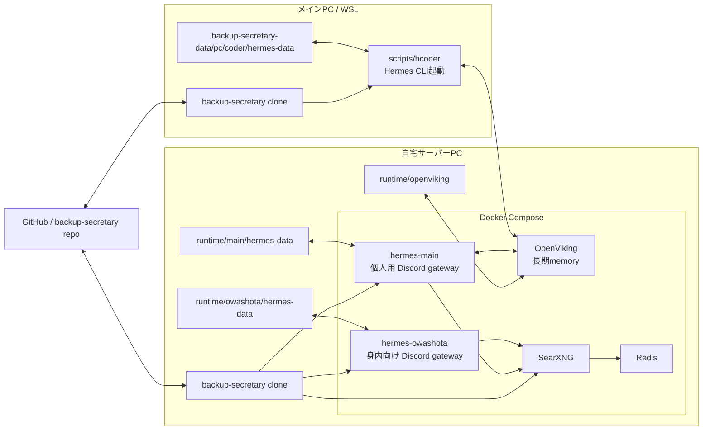
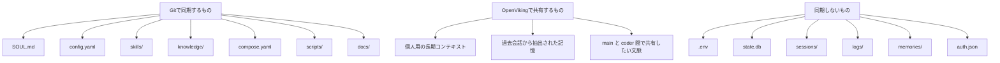
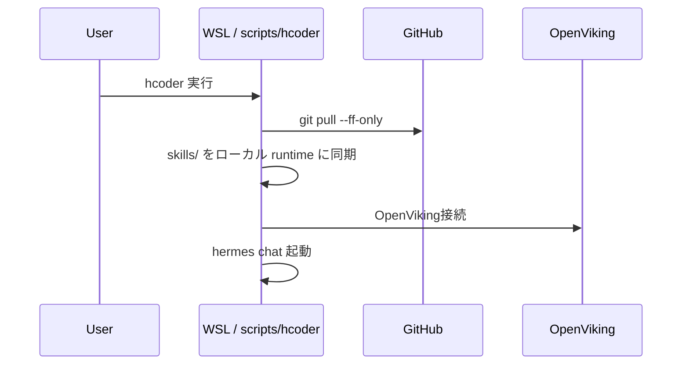
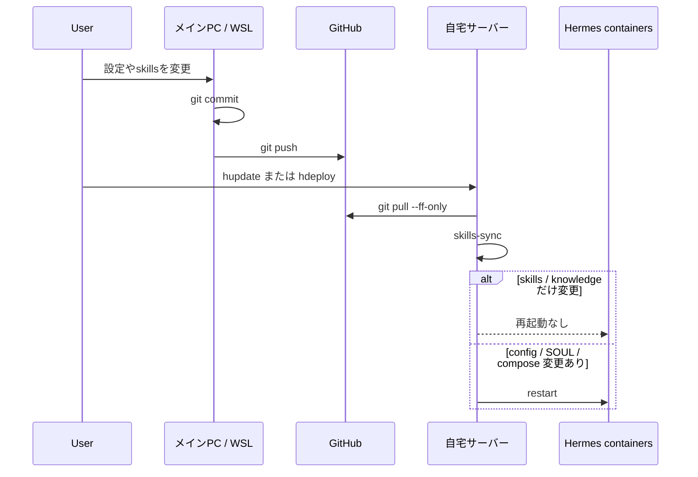

# Architecture

このブランチ (`rework/runtime-openviking`) の構成図です。

- 個人用常駐インスタンス: `hermes-main`
- 身内向け常駐インスタンス: `hermes-owashota`
- 個人用長期コンテキスト共有: `OpenViking`
- Git同期: 設定・skills・knowledge・運用スクリプト
- 非同期: `state.db` / `sessions/` / `logs/` / `memories/` / secrets

## 全体構成

## 同期モデル

## WSL から使うときの流れ

## サーバー反映フロー

## 補足

- `hermes-main` は `OpenViking` を使って、サーバーPCとメインPCの間で長期コンテキストを共有する。
- `hermes-owashota` は個人用コンテキストと混ぜない。必要なら別の account / user / agent で完全分離する。
- 直近のチャットセッションそのものは同期しない。共有するのは長期コンテキストだけ。
